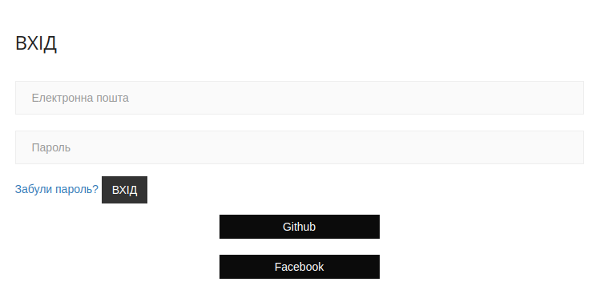
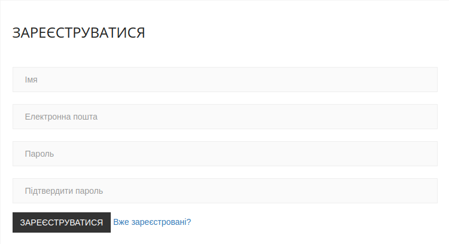
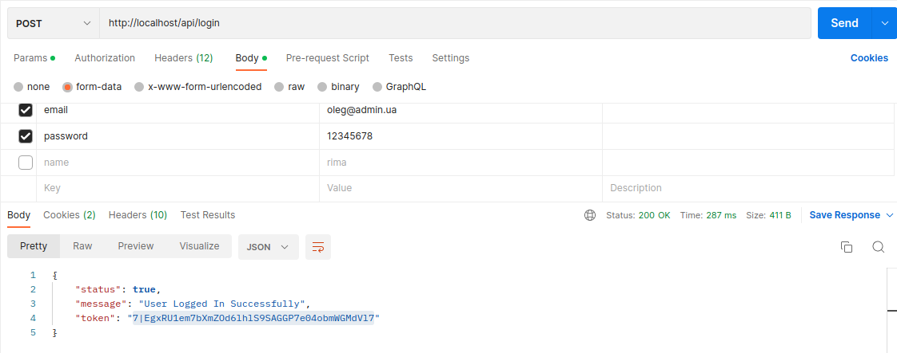
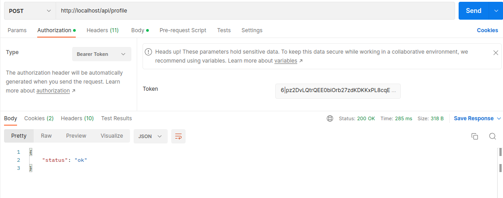

## Blog Laravel

        "php": "^8.0.2",
        "defstudio/telegraph": "^1.28",
        "doctrine/dbal": "^3.5",
        "guzzlehttp/guzzle": "^7.2",
        "http-interop/http-factory-guzzle": "^1.2",
        "kudashevs/laravel-share-buttons": "^3.1",
        "laravel/framework": "^9.19",
        "laravel/octane": "^1.3",
        "laravel/sanctum": "^3.0",
        "laravel/scout": "^9.4",
        "laravel/socialite": "^5.5",
        "laravel/telescope": "^4.9",
        "laravel/tinker": "^2.7",
        "laravelcollective/html": "^6.3",
        "meilisearch/meilisearch-php": "^0.26.0",
        "predis/predis": "^2.0"

## DataBase blog Laravel

    class categories {
    varchar(100) title
    varchar(255) slug
    timestamp created_at
    timestamp updated_at
    bigint unsigned id
    }
    
    class comments {
    text text
    int user_id
    int post_id
    timestamp created_at
    timestamp updated_at
    timestamp deleted_at
    int status
    bigint unsigned id
    }

    class failed_jobs {
    varchar(255) uuid
    text connection
    text queue
    longtext payload
    longtext exception
    timestamp failed_at
    bigint unsigned id
    }
    
    class genders {
    varchar(255) name
    bigint unsigned id
    }

    class jobs {
    varchar(255) queue
    longtext payload
    tinyint unsigned attempts
    int unsigned reserved_at
    int unsigned available_at
    int unsigned created_at
    bigint unsigned id
    }
    
    class messages {
    varchar(100) name
    varchar(255) title
    varchar(255) email
    text content
    timestamp created_at
    timestamp updated_at
    int status
    bigint unsigned id
    }

    class migrations {
    varchar(255) migration
    int batch
    int unsigned id
    }
    
    class password_resets {
    varchar(255) email
    varchar(255) token
    timestamp created_at
    }

    class personal_access_tokens {
    varchar(255) tokenable_type
    bigint unsigned tokenable_id
    varchar(255) name
    varchar(64) token
    text abilities
    timestamp last_used_at
    timestamp expires_at
    timestamp created_at
    timestamp updated_at
    bigint unsigned id
    }

    class post_tags {
    int post_id
    int tag_id
    timestamp created_at
    timestamp updated_at
    bigint unsigned id
    }

    class posts {
    varchar(100) title
    varchar(255) slug
    varchar(20) image
    text content
    int category_id
    int user_id
    int status
    int views
    int is_featured
    date s_date
    timestamp created_at
    timestamp updated_at
    timestamp deleted_at
    text description
    varchar(250) comment
    bigint unsigned id
    }

    class sessions {
    bigint unsigned user_id
    varchar(45) ip_address
    text user_agent
    longtext payload
    int last_activity
    varchar(255) id
    }

    class subscriptions {
    varchar(255) email
    varchar(255) token
    timestamp deleted_at
    timestamp created_at
    timestamp updated_at
    varchar(255) unset
    bigint unsigned id
    }

    class tags {
    varchar(100) title
    varchar(255) slug
    timestamp created_at
    timestamp updated_at
    bigint unsigned id
    }

    class telegrams {
    int update_id
    int message_id
    int from_id
    int chat_id
    varchar(255) first_name
    varchar(255) last_name
    varchar(255) username
    datetime send_date
    text text
    varchar(255) status
    timestamp created_at
    timestamp updated_at
    bigint unsigned id
    }

    class telegraph_bots {
    varchar(255) token
    varchar(255) name
    timestamp created_at
    timestamp updated_at
    bigint unsigned id
    }

    class telegraph_chats {
    varchar(255) chat_id
    varchar(255) name
    bigint unsigned telegraph_bot_id
    timestamp created_at
    timestamp updated_at
    bigint unsigned id
    }

    class telescope_entries {
    char(36) uuid
    char(36) batch_id
    varchar(255) family_hash
    tinyint(1) should_display_on_index
    varchar(20) type
    longtext content
    datetime created_at
    bigint unsigned sequence
    }

    class telescope_entries_tags {
    char(36) entry_uuid
    varchar(255) tag
    }
    
    class telescope_monitoring {
    varchar(255) tag
    }

    class users {
    varchar(255) name
    varchar(255) email
    timestamp email_verified_at
    varchar(255) password
    varchar(100) remember_token
    timestamp created_at
    timestamp updated_at
    varchar(255) avatar
    int gender_id
    date birthday
    int phone
    text comment
    text myself
    int fb_id
    int go_id
    int github_id
    timestamp deleted_at
    int is_admin
    int status
    bigint unsigned id
    }

    comments  -->  posts : post_id:id
    comments  -->  users : user_id:id
    post_tags  -->  posts : post_id:id
    post_tags  -->  tags : tag_id:id
    posts  -->  categories : category_id:id
    posts  -->  users : user_id:id
    sessions  -->  users : user_id:id
    telegrams  -->  messages : message_id:id
    telegraph_chats  -->  telegraph_bots : telegraph_bot_id:id
    telescope_entries_tags  -->  telescope_entries : entry_uuid:uuid
    users  -->  genders : gender_id:id

## Аутентифікація

Аутентифікація у блозі реалізована з Laravel Breeze.

    composer require laravel/breeze --dev

Валідація:

    public function rules()
    {
        return [
        'email' => ['required', 'string', 'email'],
        'password' => ['required', 'string'],
    ];
    }

Аутентифікація:

    public function authenticate()
    {
        $this->ensureIsNotRateLimited();
    if (! Auth::attempt($this->only('email', 'password'), $this->boolean('remember'))) {
        RateLimiter::hit($this->throttleKey());
        throw ValidationException::withMessages([
        'email' => trans('auth.failed'),
    ]);
    }
        RateLimiter::clear($this->throttleKey());
    }

## Вход через facebook, github
З Laravel socialite додано можливість входу через Github, Facebook.

SocialController:

    public function githubRedirect()
    {
        return Socialite::driver('github')->redirect();
    }

    public function loginWithGithub()
    {
        try {
            $user = Socialite::driver('github')->user();
            $isUser = User::where('github_id', $user->id)->first();
            if ($isUser) {
            Auth::login($isUser);
            } else {
            $createUser = new User();
            $createUser->name = $user->name;
            $createUser->email = $user->email;
            $createUser->github_id = $user->id;
            $createUser->password = encrypt('user');
            $createUser->save();
            Auth::login($createUser);       
            }       
            Log::info('Enter with GitHub: '.Auth::user()->name);
            return redirect('/admin/dashboard');
        } catch (Exception $exception) {
            Log::error($exception->getMessage());
        }
    }

config/service:

    'github' => [
    'client_id' => env('GITHUB_CLIENT_ID'),
    'client_secret' => env('GITHUB_CLIENT_SECRET'),
    'redirect' => 'http://localhost/auth/github/callback',
    ]

## Реєстрація

    public function store(Request $request)
    {
        $request->validate([
        'name' => ['required', 'string', 'max:255'],
        'email' => ['required', 'string', 'email', 'max:255', 'unique:users'],
        'password' => ['required', 'confirmed', Rules\Password::defaults()],
         ]);
        $user = User::create([
        'name' => $request->name,
        'email' => $request->email,
        'password' => Hash::make($request->password),
        ]);
        event(new Registered($user));
        Auth::login($user);
        Log::info('Create new user: '.$user->name);
        return redirect(RouteServiceProvider::HOME);
    }

## Subscribe

У web додаємо:

    Route::post('/subscribe', '\App\Http\Controllers\SubsController@subscribe');
    Route::get('/verify/{token}', '\App\Http\Controllers\SubsController@verify');

Контролер SubsController приймає POST запит, додає email пошти, token у БД
та відправляє для активації листа на вказану адресу.

    public function subscribe(SubscribeRequest $request): RedirectResponse
    {
        $subs = Subscription::add($request->get('email'));
        Mail::to($subs->email)->send(new SubscribeEmail($subs->token));
        Log::info('Add subscribe');
        return redirect()->back()->with('status', __('messages.check_your_mail'));
    }

При натисканні на підтвердження переходимо по GET запиту на

    Route::get('/verify/{token}', '\App\Http\Controllers\SubsController@verify');

    public function verify($token): RedirectResponse
    {
        $subs = Subscription::all()->where('token', $token)->firstOrFail();
        $subs->token = null;
        $subs->unset = Str::random(40);
        $subs->save();
        Log::info('Full subscribe');
        return redirect('/')->with('status', __('messages.your_email_has_been_verified'));
    }

Встановлюємо значення token в null і генеруємо ще одне значення unset для можливості відписатися від розсилки.

На вкладці Передплатники в адміністратора показує список усіх передплатників та їх статус,
можливість видалити вручну.

    public function destroy(int $id): RedirectResponse
    {
        Subscription::all()->find($id)->remove();
        if (Gate::denies('subscription', Subscription::class)) {
        abort(404);
    }
        Log::info('Delete email: '.Auth::user()->name);
        return redirect('/admin/subscribers');
    }

## Поділиться статтею

    composer require kudashevs/laravel-share-buttons

Створюємо окремо сторінку social.blade.php:

    

        By {{$post->user->name}} On <strong
                class="red">{{$post->getDate()}}</strong> 
        <ul class="text-center pull-right">
            <li>{!! ShareButtons::page(route('post.show', $post->slug), $post->title)->facebook() !!}</li>
            <li>{!! ShareButtons::page(route('post.show', $post->slug), $post->title)->twitter() !!}</li>
            <li>{!! ShareButtons::page(route('post.show', $post->slug), $post->title)->linkedin() !!}</li>
            <li>{!! ShareButtons::page(route('post.show', $post->slug), $post->title)->telegram() !!}</li>
            <li>{!! ShareButtons::page(route('post.show', $post->slug), $post->title)->whatsapp() !!}</li>
            <li>{!! ShareButtons::page(route('post.show', $post->slug), $post->title)->skype() !!}</li>
            <li>{!! ShareButtons::page(route('post.show', $post->slug), $post->title)->copylink() !!}</li>
            <li>{!! ShareButtons::page(route('post.show', $post->slug), $post->title)->mailto() !!}</li>
        </ul>
    

## Зараз переглядають
У контролері створюємо масив та перевіряємо користувача при завантаженні, якщо такого ip немає, та змінна
$slug не існує, то створюємо її й присвоюємо 1, якщо є, то збільшуємо на 1.

    public function show($slug): View
    {
        $post = Post::where('slug', $slug)->where('status', 1)->firstOrFail();
        $ip = [];
        $post->views += 1;
        $post->save();
        $date = Carbon::now()->addMinutes(5);
        if (Cache::has($slug) && in_array($_SERVER['REMOTE_ADDR'], $ip)) {
        Cache::increment($slug);
        $ip[] = $_SERVER['REMOTE_ADDR'];
        } elseif (!Cache::has($slug)) {
        Cache::add($slug, 1, $date);
        $ip[] = $_SERVER['REMOTE_ADDR'];
    }
        return view('pages.show', compact('post'));
    }

## Система пошуку

Реалізація за допомогою MeiliSearch

Прописуємо use Searchable; у тих моделях, які хочемо залучити.

Виконуємо імпорт моделі

    php artisan scout:import "App\Models\Post"

На клієнтській частині пошук виконується лише за статтями:

    public function index(Request $request): View
    {
        $search = $request->get('search');
        $posts = Post::search($search)->get();
        return view('search.index', ['posts' => $posts]);
    }

В адміністратора пошук виконується по всьому вмісту сайту:

    public function show(Request $request): View
    {
        $search = $request->get('search');
        $posts = Post::search($search)->get();
        if (Auth::user()->is_admin) {
        $users = User::search($search)->get();
        $comments = Comment::search($search)->get();
        $subscriptions = Subscription::search($search)->get();
        return view('admin.search.index', ['posts' => $posts, 'users' => $users, 'comments' => $comments, 'subs' => $subscriptions, 'i' => 1]);
    } else {
        $posts = $posts->where('user_id', '=', Auth::user()->id);
        return view('admin.search.index', ['posts' => $posts]);
    }
    }

## Телеграмм

Надсилання повідомлення адміну через бот.
Використовується "defstudio/telegraph": "^1.28". Після установки створюємо дві БД:

    class telegraph_bots {
    varchar(255) token
    varchar(255) name
    timestamp created_at
    timestamp updated_at
    bigint unsigned id
    }

    class telegraph_chats {
    varchar(255) chat_id
    varchar(255) name
    bigint unsigned telegraph_bot_id
    timestamp created_at
    timestamp updated_at
    bigint unsigned id
    }

Де вказуємо номер API, номер чату.

    public static function getMessages(): mixed
    {
        $chat = TelegraphBot::find(1);
        return $chat->updates();
    }

Дозволяє нам отримувати повідомлення з нашого чату.

Отримувати ми можемо автоматично, використовуючи job:

    public function handle()
    {
        Telegram::add(Chat::getMessages());
    }

Вкажемо в Kernel:
    protected function schedule(Schedule $schedule)
    {
        $schedule->job(TelegramUpdateJob::dispatch()->onQueue('telegram'))->everyThreeHours();
    }

Або вручну, викликавши на вкладці Telegram функцію оновити:

    public function update(): RedirectResponse
    {
        Telegram::add(Chat::getMessages());
        Log::info('Update telegram messages');
        return redirect()->route('telegram');
    }

Обробимо наші повідомлення та додамо до БД для подальшої обробки:

    public static function add(object $fields): void
    {
        $telegram = new static();
        $last_id = static::latest()->get()[0]->message_id;
        foreach ($fields as $item) {
        if ($last_id < $item->message()->id()) {
        $telegram->update_id = $item->id();
        $telegram->message_id = $item->message()->id();
        $telegram->from_id = $item->message()->from()->id();
        $telegram->first_name = $item->message()->from()->firstname();
        $telegram->last_name = $item->message()->from()->lastname();
        $telegram->username = $item->message()->from()->username();
        $telegram->chat_id = $item->message()->chat()->id();
        $telegram->send_date = $item->message()->date();
        $telegram->text = $item->message()->text();
        $telegram->save();
            }
        }
    }

Отримані повідомлення показуються на вкладці Telegram в адміністратора у вигляді списку.
Є можливість надіслати відповідь зі збереженням її до БД або видалити повідомлення.

Також є група з можливістю надсилання повідомлення, фото, документів.

    public function store(Request $request): RedirectResponse
    {
        if ($request->get('content')) {
        $content = str_replace(['
', '
'], '', $request->get('content'));
    } else {
        $content = '';
    }
    if ($request->get('title')) {
        $title = $request->get('title');
        $text = "<b>$title</b>\n $content";
        Chat::sendMessage($text);
        Log::info('Send telegram message: '.$title.' - '.$text);
    }
    if ($request->file('photo')) {
        Chat::sendPhoto($request->file('photo'));
        Log::info('Send telegram photo');
    }
    if ($request->file('doc')) {
        Chat::sendDocument($request->file('doc'));
        Log::info('Send telegram document');
    }
        return redirect()->route('telegram');
    }

## Пошта

Вся вхідна пошта показується в адміністратора, пункт email.

Кількість не прочитаних повідомлень
App>Providers>AppServiceProvider.php>функція boot

    view()->composer('admin.layouts', function ($view) {
        if (Auth::user()->is_admin) {
        $comments = DB::select('SELECT count(comments.status) as status FROM comments INNER JOIN posts on comments.post_id=posts.id where posts.deleted_at is NULL AND comments.deleted_at is null and comments.status=0;');
        $mail = Message::where('status', '=', 0)->count();
        return $view->with(['newCommentsCount' => $comments[0]->status, 'mail_count' => $mail]);
    } 
    });

Завантажуються списком, відсортованим за датою та статусом. Нові показуються рожевим кольором.

Можна видалити всі переглянуті або вибірково.

    public function deleteShows(): RedirectResponse
    {
        $shows = Message::where('status', 1)->delete();
        Log::info('Delete all read messages: '.Auth::user()->name);
        return back();
    }

За допомогою ajax змінюємо статус повідомлення:

    $.ajax({
    url: "{{env('APP_URL').'/admin/messages/'.$message->id}}",
    type: "put",
    data: $('form').serialize(),
    }
    )

    public function update(Request $request, int $id): RedirectResponse
    {
        $message = Message::find($id);
        $message->status = 1;
        $message->save();
        Log::info('Message status read: '.$message->title.' '.Auth::user()->name);
        return back();
    }

Усередині кожного листа є кнопка для відповіді користувачу:

    public function setAnswer(Request $request): Application|RedirectResponse|Redirector
    {
        Mail::to($request->email)->cc(Auth::user()->email)->send(new answer_email($request->all()));
        Log::info('Answer the message: '.$request->email.' '.$request->title.' --'.Auth::user()->name);
        return redirect('/admin/messages');
    }

## Поштова розсилка

Розсилання здійснюється окремо як для передплатників, так і для користувачів сайту.

Можна переглядати шаблон повідомлення для редагування.

    public function sendMailing(Request $request): RedirectResponse
    {
        $content = $request->get('content');
        $title = $request->get('title');
        $mailing = $request->get('mailing');
        $from = Auth::user()->email;
        if ($mailing == 'for_users') {
        $mails = User::pluck('email')->all();
        MailingJob::dispatch($mails, $title, $content, $from)->onQueue('mailing');
        Log::info('Mailing for users: '.Auth::user()->name);
        } elseif ($mailing == 'for_subscription') {
        $mails = Subscription::where('unset', '!=', 'null')->pluck('unset', 'email')->toArray();
        MailingSubJob::dispatch($mails, $title, $content, $from)->onQueue('mailing');
        Log::info('Mailing for subscription: '.Auth::user()->name);
    }

Відправлення робимо через MailingJob, додаючи в чергу onQueue('mailing'):

    public function handle()
    {
        foreach ($this->mails as $mail) {
        Mail::to($mail)->cc($this->from)->send(new MailingList($this->title, $this->content));
        }
    }

При розсилці передплатникам передається у тіло листа дані поля unset як id.

Формуємо рядок для відписки.

    public function unsets(Request $request): RedirectResponse
    {
        if (Subscription::unscriber($request->get('email'))) {
        Log::info('Unscriber email');
        return redirect('/')->with('status', __('messages.successfully_unsubscribed'));
        }
        Log::info('Error unscriber email');
        return redirect('/')->with('status', __('messages.you_are_not_subscribed'));
    }

У моделі Subscription:

    public static function unscriber($id): mixed
    {
        $uns = new static();
        return $uns->where('unset', $id)->delete();
    }

## Багатомовність

У Kernel>web додаємо SetLangMiddleware::class

    public function handle(Request $request, Closure $next)
    {
        $lang = Cache::has('lang') ? Cache::get('lang') : 'uk';
        App::setLocale($lang);
        return $next($request);
    }

Під час завантаження сайту виконується перевірка на наявність значення 'lang' з кешу
і надається за замовчуванням 'uk'. Після чого надане значення встановлюється як локальне.

Додаємо route:

    Route::get('/greeting/{locale}', function ($locale) {
        if (! in_array($locale, ['en', 'ru', 'uk'])) {
        abort(400);
        }
        Cache::put('lang', $locale, 1000);
        return back();
    });    

При зміні мови відбувається перевірка наявності в допустимих і заноситься нове значення
кеш.

Unit test

    public function test_lang_user()
    {
        $this->get('/greeting/uk');
        $this->assertEquals('uk', Cache::get('lang'));
        $this->get('/greeting/ru');
        $this->assertEquals('ru', Cache::get('lang'));
        $this->get('/greeting/en');
        $this->assertEquals('en', Cache::get('lang'));
        $response = $this->get('/greeting/fr');
        $this->assertEquals(400, $response->getStatusCode());
    }

## Коментарі

Показуються як у користувача, так і адміністратора.

    public function index(): View
    {
        if (Auth::user()->is_admin) {
            $comments = DB::select('SELECT comments.id, text, title, comments.status FROM comments
            INNER JOIN posts on comments.post_id=posts.id where posts.deleted_at is NULL
            AND comments.deleted_at is null order by comments.status;');
        } else {
            $comments = DB::select('SELECT comments.id, text, title, comments.status FROM comments
            INNER JOIN posts on comments.post_id=posts.id where posts.user_id=? and posts.deleted_at is NULL
            AND comments.deleted_at is null
            order by comments.status;', [Auth::user()->id]);
        }
        if (Gate::denies('comment', $comments)) {
            abort(404);
        }
            return view('admin.comments.index', ['comments' => $comments, 'i' => 1]);
}

Адміністратор може стверджувати, видаляти чи відновлювати всі коментарі блогу,
а користувач затверджує або видаляти лише ті, що належать до його статті.

    public function allow(): void
    {
    $this->status = 1;
    $this->save();
    }

    public function disAllow(): void
    {
        $this->status = 0;
        $this->save();
    }

    public function toggleStatus()
    {
        if ($this->status == 0) {
            return $this->allow();
        }

        return $this->disAllow();
    }

Unit test:

    public function test_comments()
    {
        $comment=CommentFactory::new()->make();
        $this->assertEquals(0, $comment->status);
        $comment->toggleStatus();
        $this->assertEquals(1, $comment->status);
        $comment->toggleStatus();
        $this->assertEquals(0, $comment->status);
    }

## Користувачі

Після реєстрації користувача потрібно підтвердити email. Інакше подальша робота буде
лише в обмеженому режимі. Можливість публікації статті буде тимчасово вимкнено.

Можливість змінити свої контактні дані є у вкладці Профіль.

В адміністратора є всі користувачі блогу у вигляді списку.

Через middleware реалізована можливість перегляду хто онлайн:

    public function handle(Request $request, Closure $next)
    {
        if (Auth::check()) {
            $data = Carbon::now()->addMinutes(5);
            Cache::add(Auth::user()->id, Auth::user()->id, $data);
        }
        return $next($request);
    }

Надсилання листа користувачеві:

    public function sendMailUser(Request $request): RedirectResponse
    {
        Mail::to($request->email)->cc(Auth::user()->email)->send(new SendMessageEmail($request->all()));
        Log::info('Send email user: '.$request->email.' '.$request->get('content').' --'.Auth::user()->name);
        return redirect()->route('users.index');
    }

Записати коментар для себе про користувача:

    public function addCommentUser(Request $request): RedirectResponse
    {
        $id = $request->get('id');
        $content = $request->get('content');
        $user = User::find($id);
        $user->comment = $content;
        $user->save();
        Log::info('Create comment user: '.$user->name.' '.$content.' --'.Auth::user()->name);
        return redirect()->route('users.index');
    }

Тимчасово заблокувати користувача:

    public function ban(): void
    {
        $this->status = 0;
        $this->save();
    }

    public function unban(): void
    {
        $this->status = 1;
        $this->save();
    }

    public function toggleBan($value)
    {
        if ($value == 0) {
            return $this->unban();
        }
        return $this->ban();
    }

Unit test:

    public function test_user()
    {
        $user = UserFactory::new()->make();
        $user->gender_id = 0;
        $user->name = 'Test';
        $user->birthday = '2001-01-01';
        $user->phone = 12345678;
        $user->myself = 'This is test';
        $this->assertEquals(0, $user->gender);
        $this->assertEquals('Test', $user->name);
        $this->assertEquals('2001-01-01', $user->birthday);
        $this->assertEquals('12345678', $user->phone);
        $this->assertEquals('This is test', $user->myself);
        $password = $user->password;
        $user->generatePassword('0000');
        $this->assertNotEquals($password, $user->password);
        $user->toggleBan($user->status);
        $this->assertEquals('0', $user->status);
        $user->toggleBan($user->status);
        $this->assertEquals('1', $user->status);
    }

## Безпечне видалення

Додаємо до міграції поле **$table->softDeletes()** для users, comments, subscriptions, posts.

У моделях дописуємо **use SoftDeletes;**

Адміністратор може відновити видалені записи або видалити їх остаточно.

    public function recover(Request $request)
    {
        $target = $request->get('target');
        if ($target == 'trash') {
        $id = $request->get('id');
        $this->getTrash($id);
        Log::info('Trash user: '.$id.' --'.Auth::user()->name);
            return redirect()->route('users_trash');
        } elseif ($target == 'recover') {
            $id = $request->get('id');
            $this->getRecover($id);
            Log::info('Recover user: '.$id.' --'.Auth::user()->name);

            return redirect()->route('users_trash');
        } elseif ($target == 'recover_all') {
            $users = User::onlyTrashed()->get();
            foreach ($users as $user) {
                $this->getRecover($user->id);
            }
            Log::info('Recover all users: '.' --'.Auth::user()->name);

            return redirect()->route('users_trash');
        } elseif ($target == 'trash_all') {
            $users = User::onlyTrashed()->get();
            foreach ($users as $user) {
                $this->getTrash($user->id);
            }
            Log::info('Trash all users: '.' --'.Auth::user()->name);

            return redirect()->route('users_trash');
        }
    }

    public function trash(Request $request): View
    {
        $trash = User::onlyTrashed()->get();
        return view('admin.users.trash', ['trash' => $trash]);
    }

    public function getRecover($id): void
    {
        DB::transaction(function () use ($id) {
            $posts = Post::onlyTrashed()->where('user_id', '=', $id)->get('id');
            foreach ($posts as $post) {
                Comment::onlyTrashed()->where('post_id', '=', $post->id)->restore();
            }
            Post::onlyTrashed()->where('user_id', '=', $id)->restore();
            User::onlyTrashed()->where('id', '=', $id)->restore();
        });
    }

    public function getTrash($id): void
    {
        DB::transaction(function () use ($id) {
            $posts = Post::onlyTrashed()->where('user_id', '=', $id)->get('id');
            foreach ($posts as $post) {
                Comment::onlyTrashed()->where('post_id', '=', $post->id)->forceDelete();
            }
            Post::onlyTrashed()->where('user_id', '=', $id)->forceDelete();
            User::onlyTrashed()->where('id', '=', $id)->forceDelete();
        });
    }

При видаленні користувача видаляються пости цього користувача та коментарі, які залишені під цими постами.

Також при відновленні користувача, відновлюються пости та коментарі теж.

Окремо можна видаляти пости та коментарі.

    public function getRecover($id): void
    {
        DB::transaction(function () use ($id) {
            Comment::onlyTrashed()->where('post_id', '=', $id)->restore();
            Post::onlyTrashed()->where('id', '=', $id)->restore();
        });
    }

    public function getTrash($id): void
    {
        DB::transaction(function () use ($id) {
            Comment::onlyTrashed()->where('post_id', '=', $id)->forceDelete();
            Post::onlyTrashed()->where('id', '=', $id)->forceDelete();
        });
    }

## Пости

Пост спочатку створюється у статусі чернетки, із зазначенням дати публікації посту.
Після цього можна активувати (при підтвердженні email) його або деактивувати.

    public function setDraft(): void
    {
        $this->status = 0;
        $this->save();
    }

    public function setPublic(): void
    {
        $this->status = 1;
        $this->save();
    }

    public function toggleStatus()
    {
        if ($this->status == 1) {
            return $this->setDraft();
        }

        return $this->setPublic();
    }

Адміністратор має повний список усіх постів у блозі.

Може створити або відновити пост, який видалено або видалити назавжди.

Може активувати або деактивувати пост.

Написати коментар до посту:

    public function addCommentPost(Request $request): RedirectResponse
    {
        $id = $request->get('id');
        $content = $request->get('content');
        $post = Post::all()->find($id);
        $post->comment = $content;
        $post->save();
        Log::info('Add comment: '.$post->title.' '.$post->comment.' --'.Auth::user()->name);
            return redirect()->route('posts.index');
    }

Надіслати листа автору поста:

    public function sendMailPost(Request $request): RedirectResponse
    {
        Mail::to($request->email)->cc(Auth::user()->email)->send(new SendMessageEmail($request->all()));
        Log::info('Send mail: '.$request->get('email').' '.$request->get('title').' --'.Auth::user()->name);
        return redirect()->route('posts.index');
    }

Є лічильник переглядів посту:

    $post->views += 1;

Змінити вміст статті може лише автор:

PostPolicy

    public function update(User $user, Post $post): bool
    {
        return $user->id === $post->user_id ? true : abort(403);
    }

PostController

    public function update(PostRequest $request, int $id): RedirectResponse
    {
        $post = Post::all()->find($id);
        $this->authorize('update', $post);
        $post->edit($request->all());
        $post->uploadImage($request->file('image'));
        $post->setCategory($request->get('category_id'));
        $post->setTags($request->get('tags'));
        $post->toggleStatus($request->get('status'));
        $post->toggleFeatured($request->get('is_featured'));
        Log::info('Update post: '.$request->get('title').' --'.Auth::user()->name);
        return redirect()->route('posts.index');
    }

## Share link

Laravel Share Buttons

https://github.com/kudashevs/laravel-share-buttons

Окремо створено блок коду з можливістю підключення

    

        By {{$post->user->name}} On <strong
                class="red">{{$post->getDate()}}</strong> 
        <ul class="text-center pull-right">
            <li>{!! ShareButtons::page(route('post.show', $post->slug), $post->title)->facebook() !!}</li>
            <li>{!! ShareButtons::page(route('post.show', $post->slug), $post->title)->twitter() !!}</li>
            <li>{!! ShareButtons::page(route('post.show', $post->slug), $post->title)->linkedin() !!}</li>
            <li>{!! ShareButtons::page(route('post.show', $post->slug), $post->title)->telegram() !!}</li>
            <li>{!! ShareButtons::page(route('post.show', $post->slug), $post->title)->whatsapp() !!}</li>
            <li>{!! ShareButtons::page(route('post.show', $post->slug), $post->title)->skype() !!}</li>
            <li>{!! ShareButtons::page(route('post.show', $post->slug), $post->title)->copylink() !!}</li>
            <li>{!! ShareButtons::page(route('post.show', $post->slug), $post->title)->mailto() !!}</li>
        </ul>
    

## API with sanctum

Створюємо Api\AuthController:

    public function createUser(Request $request)
    {
    try {
    $validateUser = Validator::make($request->all(),
    [
    'name' => 'required',
    'email' => 'required|email|unique:users,email',
    'password' => 'required'
    ]);
            if($validateUser->fails()){
                return response()->json([
                    'status' => false,
                    'message' => 'validation error',
                    'errors' => $validateUser->errors()
                ], 401);
            }

            $user = User::create([
                'name' => $request->name,
                'email' => $request->email,
                'password' => Hash::make($request->password)
            ]);

            return response()->json([
                'status' => true,
                'message' => 'User Created Successfully',
                'token' => $user->createToken("API TOKEN")->plainTextToken
            ], 200);

        } catch (\Throwable $th) {
            return response()->json([
                'status' => false,
                'message' => $th->getMessage()
            ], 500);
        }
    }

    public function loginUser(Request $request)
    {
        try {
            $validateUser = Validator::make($request->all(),
                [
                    'email' => 'required|email',
                    'password' => 'required'
                ]);

            if($validateUser->fails()){
                return response()->json([
                    'status' => false,
                    'message' => 'validation error',
                    'errors' => $validateUser->errors()
                ], 401);
            }

            if(!Auth::attempt($request->only(['email', 'password']))){
                return response()->json([
                    'status' => false,
                    'message' => 'Email & Password does not match with our record.',
                ], 401);
            }

            $user = User::where('email', $request->email)->first();

            return response()->json([
                'status' => true,
                'message' => 'User Logged In Successfully',
                'token' => $user->createToken("API TOKEN")->plainTextToken
            ], 200);

        } catch (\Throwable $th) {
            return response()->json([
                'status' => false,
                'message' => $th->getMessage()
            ], 500);
        }
    }
    public function me(Request $request)
    {
        return $request->user();
    }

Отримуємо токен, який можемо використовувати для запитів:

routes/api:

    Route::post('/login', '\App\Http\Controllers\Api\AuthController@loginUser');
    Route::post('/register', '\App\Http\Controllers\Api\AuthController@createUser');
    Route:: middleware('auth:sanctum')->group(function () {
    Route::get('/me', '\App\Http\Controllers\Api\AuthController@me');
    Route::apiResource('/profile', '\App\Http\Controllers\Api\ProfileController');
    Route::apiResource('/post', '\App\Http\Controllers\Api\PostsController');
    });
    Route::get('/category', '\App\Http\Controllers\Api\CategoriesController@index');
    Route::get('/tags', '\App\Http\Controllers\Api\TagsController@index');

У Headers Accept змінюємо на application/json
і додаємо Authorization з token
Authorization Bearer ******************************
Controllers/Api/PostController:

http://localhost/api/post method: GET action:index

    public function index(): JsonResponse
    {
        try {
        if (Auth::user()->is_admin) {
            $posts = Post::all();
        } else {
            $posts = Post::all()->where('user_id', '=', Auth::user()->id);
        }
        } catch (\Exception $e) {
            Log::info('Show posts: ' . ' --' . Auth::user()->name);
            return response()->json(['status' => 'error'])->setStatusCode(400);
        }
            return response()->json($posts);
    }

http://localhost/api/post/15 method: GET action:show

    public function show($id): JsonResponse
    {
    try {
        if (Auth::user()->is_admin) {
        $posts = Post::find($id);
    } else {
        $posts = Post::find($id)->where('user_id', '=', Auth::user()->id);
    }
    if(!empty($posts)){
        return response()->json($posts);
    }else throw new \Exception();
    }
    catch (\Exception $e) {
        Log::info('Show posts: ' . ' --' . Auth::user()->name);
        return response()->json(['status' => 'error'])->setStatusCode(400);
        }
    }

http://localhost/api/post method: POST action:store

    public function store(PostRequest $request): JsonResponse
    {
        try {
            $post = Post::add($request->all());
            $post->uploadImage($request->file('image'));
            $post->toggleFeatured($request->get('is_featured'));
            Log::info('Create post: ' . $request->get('title') . ' ' . Auth::user()->name);
            return response()->json(['status' => 'ok']);
        } catch (\Exception $e) {
            Log::info('Update post: ' . $request->get('title') . ' --' . Auth::user()->name);
            return response()->json(['status' => 'error'])->setStatusCode(400);
        }
    }

http://localhost/api/post/15 method: PUT action:update

    public function update(PostRequest $request, $id): JsonResponse
    {
        try {
            $post = Post::find($id);
            if($post->user_id!=Auth::user()->id){
            throw new \Exception();
        }
            $post->edit($request->all(), $id);
            $post->uploadImage($request->file('image'));
            $post->toggleFeatured($request->get('is_featured'));
            Log::info('Update post: ' . $request->get('title') . ' --' . Auth::user()->name);
            return response()->json(['status' => 'ok']);
        } catch (\Exception $e) {
            Log::info('Update post: ' . $request->get('title') . ' --' . Auth::user()->name);
            return response()->json(['status' => 'error'])->setStatusCode(400);
        }
    }

http://localhost/api/post_delete/11 method:delete action:destroy

    public function destroy(int $id)
    {
    try {
        DB::transaction(function () use ($id) {
        $post = Post::find($id);
        if ($post->user_id == Auth::user()->id) {
            Post::find($id)->remove();
            Comment::where('post_id', '=', $id)->delete();
            DB::commit();
        } else {
            throw new \Exception('Error');
        }
        });
    } catch (\Exception $e) {
            Log::info('Delete post error: ' . $id . ' --' . Auth::user()->name);
            return response()->json(['status' => 'error'])->setStatusCode(400);
        }
            Log::info('Delete post: ' . $id . ' --' . Auth::user()->name);
            return response()->json(['status' => 'ok']);
    }

Робимо перевірку, якщо стаття належить даному користувачеві, то видаляємо статтю та коментарі до неї.

Якщо не належить чи ні такого id викликаємо виняток та повертаємо 400.

Реалізуємо для Profile

http://localhost/api/profile method:GET action:index

    public function index(): JsonResponse
    {
        try {
            $user = Auth::user();
            Log::info('Api get profile: ' . $user->id . ' ' . $user->name . ' ' . $user->email);
            return response()->json($user);
        }catch (\Exception $e) {
            Log::info('Api error profile: ' . $user->id . ' ' . $user->name . ' ' . $user->email);
            return response()->json(['status' => 'error'])->setStatusCode(400);
        }
    }

http://localhost/api/profile method:PUT action:update

    public function update(Request $request): JsonResponse
    {
        try {
            $user = Auth::user();
            User::edit($request->all(), $user->id);
            Log::info('Api update profile, status ok: ' . $user->id . ' ' . $user->name . ' ' . $user->email);
        }catch (\Exception $e) {
            Log::info('Api update profile, status error: ' . $user->id . ' ' . $user->name . ' ' . $user->email);
            return response()->json(['status' => 'error'])->setStatusCode(400);
        }
        return response()->json(['status' => 'ok']);
    }

Unit test:

    public function test_authorize()
    {
        $response = $this->post('/api/register', ['name' => 'Api_User', 'email' => 'api_user@admin.ua', 'password' => 12345678]);
    if ($response->getStatusCode() != 200) {
        $response = $this->post('/api/login', ['email' => 'api_user@admin.ua', 'password' => 12345678]);
    }
        $response->assertOk();
    }

    public function test_category()
    {
        $category = $this->get('/api/category');
        $this->assertEquals(200, $category->status());
        $this->assertNotEmpty($category);
    }

    public function test_tags()
    {
        $tags = $this->get('/api/category');
        $tags->assertOk();
    }

    public function test_profile()
    {

        Sanctum::actingAs(
            User::find(1),
            ['*']
        );
        $profile = $this->json('GET', '/api/profile');
        $profile->assertOk();
    }

    public function test_post()
    {

        Sanctum::actingAs(
            User::find(1),
            ['*']
        );
        $profile = $this->json('GET', '/api/post');
        $profile->assertOk();
    }

## PHPStan та перевірка перед зберіганням
Створюємо файл Pre-commit в .git/hooks/

    #!/bin/sh

    CHANGED_FILES_PHP=$(git diff --cached --name-only --diff-filter=ACMR | grep ".php\$" | grep app )
    
    if [ -z "$CHANGED_FILES_PHP" ]

    then

        echo "No PHP and VUE files found. No reason to run checks."

        exit 0

    else
        set -e
        if [ "$CHANGED_FILES_PHP" ]
        then
            vendor/bin/phpstan analyse app $CHANGED_FILES_PHP
            if [ -z "$CHANGED_FILES_PHP" ]
            then
                black --check $CHANGED_FILES_PHP
            fi
        fi
    fi
    echo "All checks successfully passed."

Де app розділ для перевірки файлів.

Якщо помилок немає то виконається commit, якщо є, то видасть помилки для виправлення.

## Env example

Оновимо env.example автоматично:

Встановимо:

    composer require worksome/envy --dev
    php artisan envy:install

Після чого виконаємо:

    php artisan envy:sync

## Laravel Envoy 
После установки Envoy создадим файл внутри корня сайта:

php vendor/bin/envoy init localhost

Внутри файла Envoy.blade.php создадим задачу:

    @servers(['web' => 'localhost'])
    
    @task('telescope')
    php artisan telescope:prune
    @endtask

php vendor/bin/envoy run telescope
