## Blog Laravel

        "php": "^8.0.2",
        "defstudio/telegraph": "^1.28",
        "doctrine/dbal": "^3.5",
        "guzzlehttp/guzzle": "^7.2",
        "http-interop/http-factory-guzzle": "^1.2",
        "kudashevs/laravel-share-buttons": "^3.1",
        "laravel/framework": "^9.19",
        "laravel/octane": "^1.3",
        "laravel/sanctum": "^3.0",
        "laravel/scout": "^9.4",
        "laravel/socialite": "^5.5",
        "laravel/telescope": "^4.9",
        "laravel/tinker": "^2.7",
        "laravelcollective/html": "^6.3",
        "meilisearch/meilisearch-php": "^0.26.0",
        "predis/predis": "^2.0"

## DataBase blog Laravel

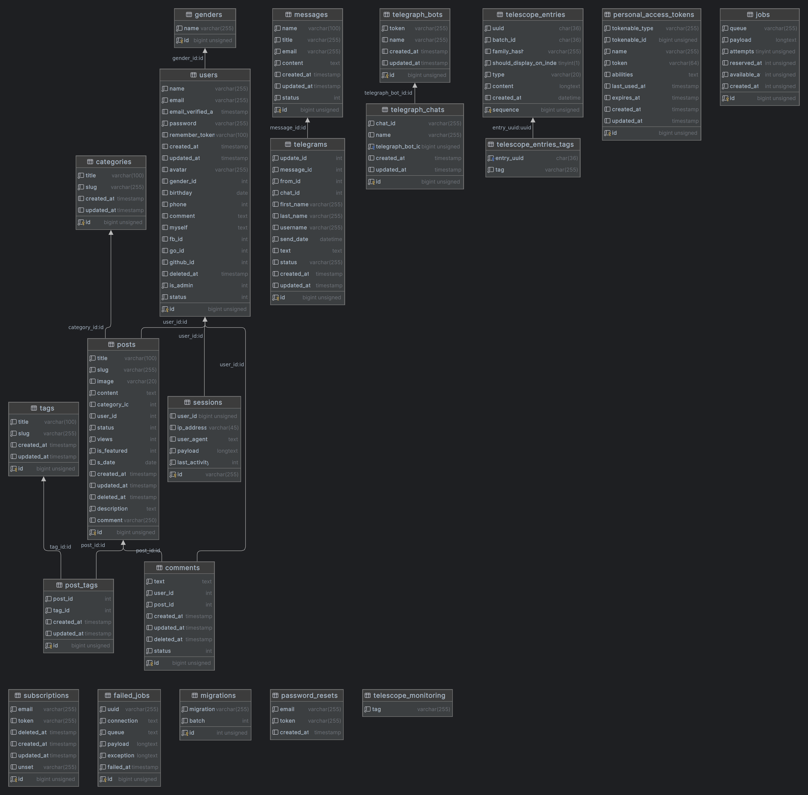

    class categories {
    varchar(100) title
    varchar(255) slug
    timestamp created_at
    timestamp updated_at
    bigint unsigned id
    }
    
    class comments {
    text text
    int user_id
    int post_id
    timestamp created_at
    timestamp updated_at
    timestamp deleted_at
    int status
    bigint unsigned id
    }

    class failed_jobs {
    varchar(255) uuid
    text connection
    text queue
    longtext payload
    longtext exception
    timestamp failed_at
    bigint unsigned id
    }
    
    class genders {
    varchar(255) name
    bigint unsigned id
    }

    class jobs {
    varchar(255) queue
    longtext payload
    tinyint unsigned attempts
    int unsigned reserved_at
    int unsigned available_at
    int unsigned created_at
    bigint unsigned id
    }
    
    class messages {
    varchar(100) name
    varchar(255) title
    varchar(255) email
    text content
    timestamp created_at
    timestamp updated_at
    int status
    bigint unsigned id
    }

    class migrations {
    varchar(255) migration
    int batch
    int unsigned id
    }
    
    class password_resets {
    varchar(255) email
    varchar(255) token
    timestamp created_at
    }

    class personal_access_tokens {
    varchar(255) tokenable_type
    bigint unsigned tokenable_id
    varchar(255) name
    varchar(64) token
    text abilities
    timestamp last_used_at
    timestamp expires_at
    timestamp created_at
    timestamp updated_at
    bigint unsigned id
    }

    class post_tags {
    int post_id
    int tag_id
    timestamp created_at
    timestamp updated_at
    bigint unsigned id
    }

    class posts {
    varchar(100) title
    varchar(255) slug
    varchar(20) image
    text content
    int category_id
    int user_id
    int status
    int views
    int is_featured
    date s_date
    timestamp created_at
    timestamp updated_at
    timestamp deleted_at
    text description
    varchar(250) comment
    bigint unsigned id
    }

    class sessions {
    bigint unsigned user_id
    varchar(45) ip_address
    text user_agent
    longtext payload
    int last_activity
    varchar(255) id
    }

    class subscriptions {
    varchar(255) email
    varchar(255) token
    timestamp deleted_at
    timestamp created_at
    timestamp updated_at
    varchar(255) unset
    bigint unsigned id
    }

    class tags {
    varchar(100) title
    varchar(255) slug
    timestamp created_at
    timestamp updated_at
    bigint unsigned id
    }

    class telegrams {
    int update_id
    int message_id
    int from_id
    int chat_id
    varchar(255) first_name
    varchar(255) last_name
    varchar(255) username
    datetime send_date
    text text
    varchar(255) status
    timestamp created_at
    timestamp updated_at
    bigint unsigned id
    }

    class telegraph_bots {
    varchar(255) token
    varchar(255) name
    timestamp created_at
    timestamp updated_at
    bigint unsigned id
    }

    class telegraph_chats {
    varchar(255) chat_id
    varchar(255) name
    bigint unsigned telegraph_bot_id
    timestamp created_at
    timestamp updated_at
    bigint unsigned id
    }

    class telescope_entries {
    char(36) uuid
    char(36) batch_id
    varchar(255) family_hash
    tinyint(1) should_display_on_index
    varchar(20) type
    longtext content
    datetime created_at
    bigint unsigned sequence
    }

    class telescope_entries_tags {
    char(36) entry_uuid
    varchar(255) tag
    }
    
    class telescope_monitoring {
    varchar(255) tag
    }

    class users {
    varchar(255) name
    varchar(255) email
    timestamp email_verified_at
    varchar(255) password
    varchar(100) remember_token
    timestamp created_at
    timestamp updated_at
    varchar(255) avatar
    int gender_id
    date birthday
    int phone
    text comment
    text myself
    int fb_id
    int go_id
    int github_id
    timestamp deleted_at
    int is_admin
    int status
    bigint unsigned id
    }

    comments  -->  posts : post_id:id
    comments  -->  users : user_id:id
    post_tags  -->  posts : post_id:id
    post_tags  -->  tags : tag_id:id
    posts  -->  categories : category_id:id
    posts  -->  users : user_id:id
    sessions  -->  users : user_id:id
    telegrams  -->  messages : message_id:id
    telegraph_chats  -->  telegraph_bots : telegraph_bot_id:id
    telescope_entries_tags  -->  telescope_entries : entry_uuid:uuid
    users  -->  genders : gender_id:id

## Регистрация через facebook, github

## Подписка

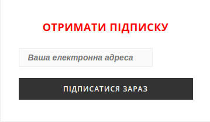

В web добавляем:

    Route::post('/subscribe', '\App\Http\Controllers\SubsController@subscribe');
    Route::get('/verify/{token}', '\App\Http\Controllers\SubsController@verify');

Контроллер SubsController принимает POST запрос, добавляет адресс почты, token в БД
и отправляет для активации письмо на указанный адрес.

    public function subscribe(SubscribeRequest $request): RedirectResponse
    {
    $subs = Subscription::add($request->get('email'));
    Mail::to($subs->email)->send(new SubscribeEmail($subs->token));
    Log::info('Add subscribe');
    return redirect()->back()->with('status', __('messages.check_your_mail'));
        }

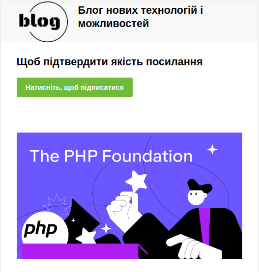

При нажатии на подтверждение, переходим по GET запросу на    
Route::get('/verify/{token}', '\App\Http\Controllers\SubsController@verify');

    public function verify($token): RedirectResponse
    {
    $subs = Subscription::all()->where('token', $token)->firstOrFail();
    $subs->token = null;
    $subs->unset = Str::random(40);
    $subs->save();
    Log::info('Full subscribe');
    return redirect('/')->with('status', __('messages.your_email_has_been_verified'));
        }

Устанавливаем значение token в null, и генерируем еще одно значение unset для возможности отписаться от рассылки.

На вкладке Подписчики у администратора отображается список всех подписчиков и их статус,
возможность удалить вручную.

    public function destroy(int $id): RedirectResponse
    {
    Subscription::all()->find($id)->remove();
    if (Gate::denies('subscription', Subscription::class)) {
    abort(404);
    }
    Log::info('Delete email: '.Auth::user()->name);
    return redirect('/admin/subscribers');
        }

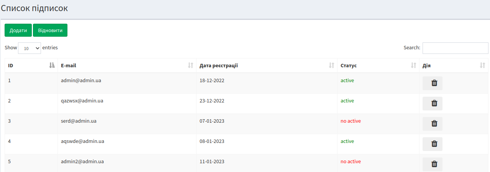

## Система поиска

Реализация с помощью MeiliSearch

Прописываем use Searchable; в тех моделях которые хотим задействовать.

Выполняем импорт модели

    php artisan scout:import "App\Models\Post"

На клиентской части поиск выполняется только по статьям:

    public function index(Request $request): View
    {
    $search = $request->get('search');
    $posts = Post::search($search)->get();
    return view('search.index', ['posts' => $posts]);
        }

У администратора поис выполняется по всему содержимому сайта:

    public function show(Request $request): View
    {
    $search = $request->get('search');
    $posts = Post::search($search)->get();
    if (Auth::user()->is_admin) {
    $users = User::search($search)->get();
    $comments = Comment::search($search)->get();
    $subscriptions = Subscription::search($search)->get();
    return view('admin.search.index', ['posts' => $posts, 'users' => $users, 'comments' => $comments, 'subs' => $subscriptions, 'i' => 1]);
    } else {
    $posts = $posts->where('user_id', '=', Auth::user()->id);
    return view('admin.search.index', ['posts' => $posts]);
    }
        }

## Телеграмм

Отправка сообщения админу через бота.
Используется "defstudio/telegraph": "^1.28". После установке создаем две БД:

    class telegraph_bots {
    varchar(255) token
    varchar(255) name
    timestamp created_at
    timestamp updated_at
    bigint unsigned id
    }

    class telegraph_chats {
    varchar(255) chat_id
    varchar(255) name
    bigint unsigned telegraph_bot_id
    timestamp created_at
    timestamp updated_at
    bigint unsigned id
    }

где, указываем номер API, номер чата.

    public static function getMessages(): mixed
    {
    $chat = TelegraphBot::find(1);
    return $chat->updates();
        }

Позволяет нам получать сообщения из нашего чата.

Получать мы можем автоматически, используюя job:

    public function handle()
    {
    Telegram::add(Chat::getMessages());
    }

Пропишим в Kernel:
protected function schedule(Schedule $schedule)
{
$schedule->job(TelegramUpdateJob::dispatch()->onQueue('telegram'))->everyThreeHours();
}

Или в ручную вызвав на вкладке Telegram функцию обновить:

    public function update(): RedirectResponse
    {
    Telegram::add(Chat::getMessages());
    Log::info('Update telegram messages');
    return redirect()->route('telegram');
        }

Распарсим наши сообщения и добавим в БД для дальнейшей обработки:

    public static function add(object $fields): void
    {
    $telegram = new static();
    $last_id = static::latest()->get()[0]->message_id;
    foreach ($fields as $item) {
    if ($last_id < $item->message()->id()) {
    $telegram->update_id = $item->id();
    $telegram->message_id = $item->message()->id();
    $telegram->from_id = $item->message()->from()->id();
    $telegram->first_name = $item->message()->from()->firstname();
    $telegram->last_name = $item->message()->from()->lastname();
    $telegram->username = $item->message()->from()->username();
    $telegram->chat_id = $item->message()->chat()->id();
    $telegram->send_date = $item->message()->date();
    $telegram->text = $item->message()->text();
    $telegram->save();
    }
    }
    }

Полученные сообщения отображаются на вкладке Telegram у администратора в виде списка.
Есть возможность отправить ответ с сохранением его в БД или удалить сообщение.

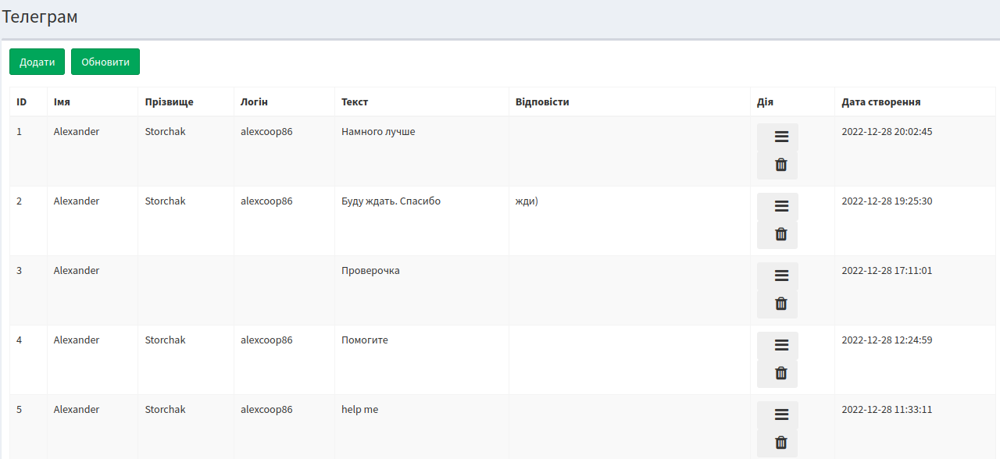

Также есть группа, с возможностью отправления сообщения, фото, документов.

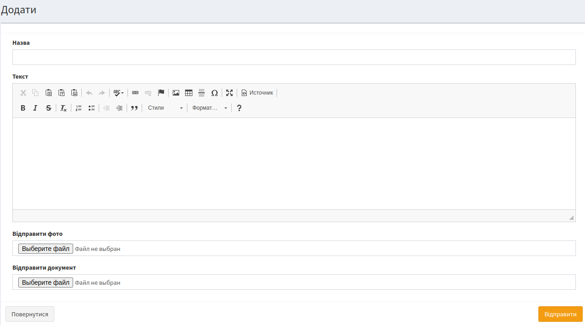

    public function store(Request $request): RedirectResponse
    {
    if ($request->get('content')) {
    $content = str_replace(['
', '
'], '', $request->get('content'));
    } else {
    $content = '';
    }
    if ($request->get('title')) {
    $title = $request->get('title');
    $text = "<b>$title</b>\n $content";
    Chat::sendMessage($text);
    Log::info('Send telegram message: '.$title.' - '.$text);
    }
    if ($request->file('photo')) {
    Chat::sendPhoto($request->file('photo'));
    Log::info('Send telegram photo');
    }
    if ($request->file('doc')) {
    Chat::sendDocument($request->file('doc'));
    Log::info('Send telegram document');
    }
    return redirect()->route('telegram');
        }

## Почта

Вся входящая почта отображается у администратора, пункт email.

Количество не прочитанных сообщений
App>Providers>AppServiceProvider.php>финкция boot

    view()->composer('admin.layouts', function ($view) {
    if (Auth::user()->is_admin) {
    $comments = DB::select('SELECT count(comments.status) as status FROM comments INNER JOIN posts on comments.post_id=posts.id where posts.deleted_at is NULL AND comments.deleted_at is null and comments.status=0;');
    $mail = Message::where('status', '=', 0)->count();
    return $view->with(['newCommentsCount' => $comments[0]->status, 'mail_count' => $mail]);
    } 
    });

Загружаются списком, отсортированным по дате и статусу. Новые отображаются розовым цветом.
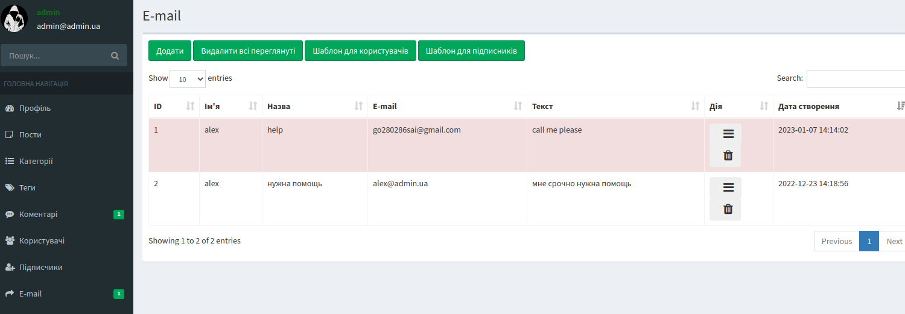
Можно удалить все просмотренные или выборочно.

    public function deleteShows(): RedirectResponse
    {
    $shows = Message::where('status', 1)->delete();
    Log::info('Delete all read messages: '.Auth::user()->name);
    return back();
        }

С помощью ajax меняем статус сообщения:

    $.ajax({
    url: "{{env('APP_URL').'/admin/messages/'.$message->id}}",
    type: "put",
    data: $('form').serialize(),
    }
    )

    public function update(Request $request, int $id): RedirectResponse
    {
    $message = Message::find($id);
    $message->status = 1;
    $message->save();
    Log::info('Message status read: '.$message->title.' '.Auth::user()->name);
    return back();
        }

В нутри каждого письма есть кнопка для ответа пользователю:

    public function setAnswer(Request $request): Application|RedirectResponse|Redirector
    {
    Mail::to($request->email)->cc(Auth::user()->email)->send(new answer_email($request->all()));
    Log::info('Answer the message: '.$request->email.' '.$request->title.' --'.Auth::user()->name);
    return redirect('/admin/messages');
        }

## Почтовая рассылка

Рассылка выполняется отдельно как для подписчиков так и для пользователей сайта.

Есть возможность просмотра шаблона сообщения для редактирования.

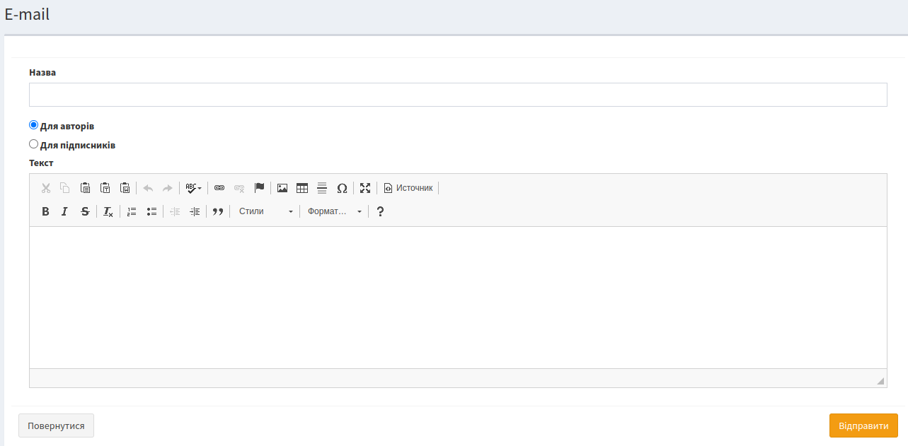

    public function sendMailing(Request $request): RedirectResponse
    {
    $content = $request->get('content');
    $title = $request->get('title');
    $mailing = $request->get('mailing');
    $from = Auth::user()->email;
    if ($mailing == 'for_users') {
    $mails = User::pluck('email')->all();
    MailingJob::dispatch($mails, $title, $content, $from)->onQueue('mailing');
    Log::info('Mailing for users: '.Auth::user()->name);
    } elseif ($mailing == 'for_subscription') {
    $mails = Subscription::where('unset', '!=', 'null')->pluck('unset', 'email')->toArray();
    MailingSubJob::dispatch($mails, $title, $content, $from)->onQueue('mailing');
    Log::info('Mailing for subscription: '.Auth::user()->name);
    }

Отправку делаем через MailingJob добавляя в очередь onQueue('mailing'):

    public function handle()
    {
    foreach ($this->mails as $mail) {
    Mail::to($mail)->cc($this->from)->send(new MailingList($this->title, $this->content));
    }
    }

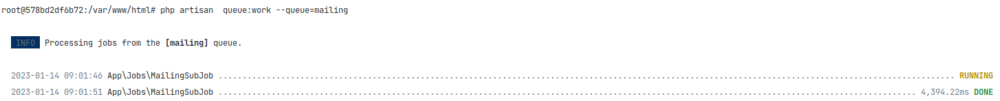

При рассылке подписчикам передается в тело письма данные поля unset в виде id.
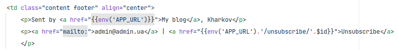

Формируем строку для отписки.

    public function unsets(Request $request): RedirectResponse
    {
    if (Subscription::unscriber($request->get('email'))) {
    Log::info('Unscriber email');
    return redirect('/')->with('status', __('messages.successfully_unsubscribed'));
    }
    Log::info('Error unscriber email');
    return redirect('/')->with('status', __('messages.you_are_not_subscribed'));
        }

В модели Subscription:

    public static function unscriber($id): mixed
    {
    $uns = new static();
    return $uns->where('unset', $id)->delete();
        }

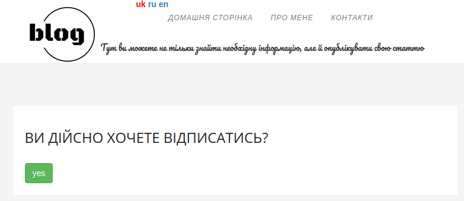

## Мультиязычность

В Kernel>web добавляем SetLangMiddleware::class

    public function handle(Request $request, Closure $next)
    {
    $lang = Cache::has('lang') ? Cache::get('lang') : 'uk';
    App::setLocale($lang);
        return $next($request);
    }

При загрузке сайта выполняется проверка на наличие значения 'lang' из кеша
и присваивается по умолчанию 'uk'. После чего присвоенное значение устанавливается как локальное.

Добавляем route:

        Route::get('/greeting/{locale}', function ($locale) {
        if (! in_array($locale, ['en', 'ru', 'uk'])) {
        abort(400);
        }
        Cache::put('lang', $locale, 1000);
        return back();
        });

При смене языка проискодит проверка наличия в допустимых и заносится новое значение в
кеш.

Unit test

    public function test_lang_user()
    {
    $this->get('/greeting/uk');
    $this->assertEquals('uk', Cache::get('lang'));
    $this->get('/greeting/ru');
    $this->assertEquals('ru', Cache::get('lang'));
    $this->get('/greeting/en');
    $this->assertEquals('en', Cache::get('lang'));
    $response = $this->get('/greeting/fr');
    $this->assertEquals(400, $response->getStatusCode());
    }
    }

## Комментарии

Отображаются как у пользователя так и у администратора.

    public function index(): View
    {
    if (Auth::user()->is_admin) {
    $comments = DB::select('SELECT comments.id, text, title, comments.status FROM comments
    INNER JOIN posts on comments.post_id=posts.id where posts.deleted_at is NULL
    AND comments.deleted_at is null order by comments.status;');
    } else {
    $comments = DB::select('SELECT comments.id, text, title, comments.status FROM comments
    INNER JOIN posts on comments.post_id=posts.id where posts.user_id=? and posts.deleted_at is NULL
    AND comments.deleted_at is null
    order by comments.status;', [Auth::user()->id]);
    }
    if (Gate::denies('comment', $comments)) {
    abort(404);
    }
    return view('admin.comments.index', ['comments' => $comments, 'i' => 1]);
        }

Администратор может утверждать, удалять или восстанавливать все комментарии блога,
а пользователь утверждать или удалять только те, которые относятся к его статье.

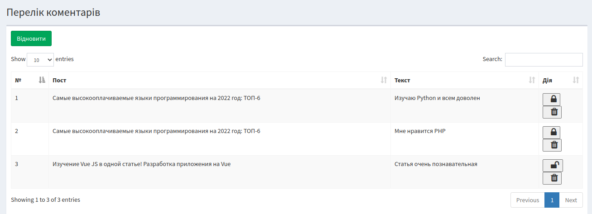

    public function allow(): void
    {
    $this->status = 1;
    $this->save();
    }

    public function disAllow(): void
    {
        $this->status = 0;
        $this->save();
    }

    public function toggleStatus()
    {
        if ($this->status == 0) {
            return $this->allow();
        }

        return $this->disAllow();
    }

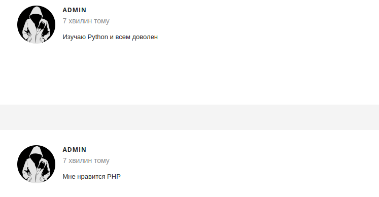

Unit test:

    public function test_comments()
    {
    $comment=CommentFactory::new()->make();
    $this->assertEquals(0, $comment->status);
    $comment->toggleStatus();
    $this->assertEquals(1, $comment->status);
    $comment->toggleStatus();
    $this->assertEquals(0, $comment->status);
    }

## Пользователи

После регистрации пользователя, нужно подтвердить email. Иначе дальнейшая работа будет
только в ограниченной режиме. Возможность публикации статьи будет временно отключена.

Возможность изменить свои контактные данные есть во вкладке Профиль.

У администратора отображаются все пользователи блога в виде списка.
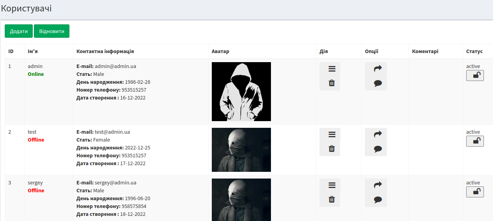

Через middleware реализована возможность просмотра кто онлайн:

    public function handle(Request $request, Closure $next)
    {
    if (Auth::check()) {
    $data = Carbon::now()->addMinutes(5);
    Cache::add(Auth::user()->id, Auth::user()->id, $data);
    }
    return $next($request);
        }

Отправка письма пользователю:

    public function sendMailUser(Request $request): RedirectResponse
    {
    Mail::to($request->email)->cc(Auth::user()->email)->send(new SendMessageEmail($request->all()));
    Log::info('Send email user: '.$request->email.' '.$request->get('content').' --'.Auth::user()->name);
    return redirect()->route('users.index');
        }

Записать комментарий для себя о пользователе:

    public function addCommentUser(Request $request): RedirectResponse
    {
    $id = $request->get('id');
    $content = $request->get('content');
    $user = User::find($id);
    $user->comment = $content;
    $user->save();
    Log::info('Create comment user: '.$user->name.' '.$content.' --'.Auth::user()->name);
    return redirect()->route('users.index');
        }

Временно заблокировать пользователя:

    public function ban(): void
    {
        $this->status = 0;
        $this->save();
    }

    public function unban(): void
    {
        $this->status = 1;
        $this->save();
    }

    public function toggleBan($value)
    {
        if ($value == 0) {
            return $this->unban();
        }
        return $this->ban();
    }

Unit test:

    public function test_user()
    {
    $user = UserFactory::new()->make();
    $user->gender_id = 0;
    $user->name = 'Test';
    $user->birthday = '2001-01-01';
    $user->phone = 12345678;
    $user->myself = 'This is test';
    $this->assertEquals(0, $user->gender);
    $this->assertEquals('Test', $user->name);
    $this->assertEquals('2001-01-01', $user->birthday);
    $this->assertEquals('12345678', $user->phone);
    $this->assertEquals('This is test', $user->myself);
    $password = $user->password;
    $user->generatePassword('0000');
    $this->assertNotEquals($password, $user->password);
    $user->toggleBan($user->status);
    $this->assertEquals('0', $user->status);
    $user->toggleBan($user->status);
    $this->assertEquals('1', $user->status);
    }

## Безопасное удаление

Добавляем в миграцию поле **$table->softDeletes()** для users, comments, subscriptions, posts.

В моделях дописываем **use SoftDeletes;**

Администратор может воccтановить удаленные записи или удалить их окончательно.

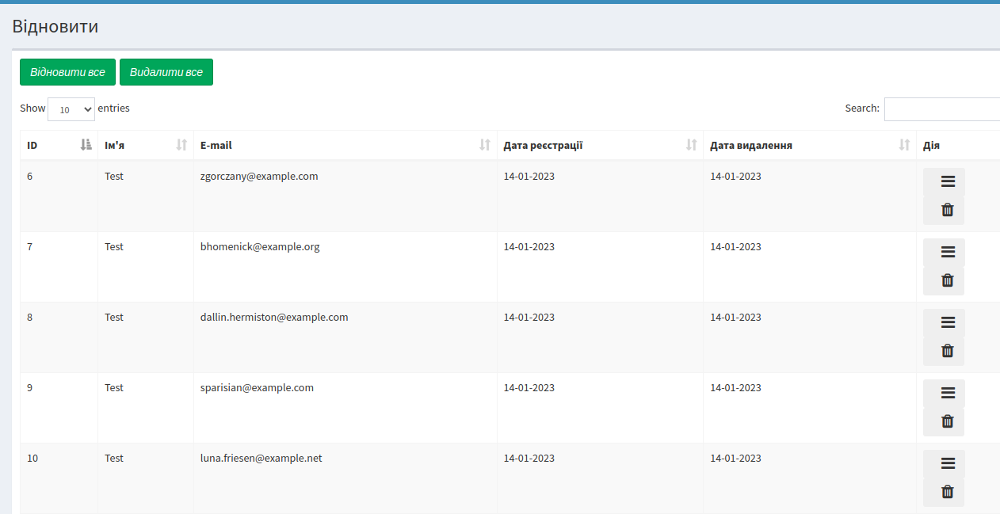

    public function recover(Request $request)
    {
    $target = $request->get('target');
    if ($target == 'trash') {
    $id = $request->get('id');
    $this->getTrash($id);
    Log::info('Trash user: '.$id.' --'.Auth::user()->name);
            return redirect()->route('users_trash');
        } elseif ($target == 'recover') {
            $id = $request->get('id');
            $this->getRecover($id);
            Log::info('Recover user: '.$id.' --'.Auth::user()->name);

            return redirect()->route('users_trash');
        } elseif ($target == 'recover_all') {
            $users = User::onlyTrashed()->get();
            foreach ($users as $user) {
                $this->getRecover($user->id);
            }
            Log::info('Recover all users: '.' --'.Auth::user()->name);

            return redirect()->route('users_trash');
        } elseif ($target == 'trash_all') {
            $users = User::onlyTrashed()->get();
            foreach ($users as $user) {
                $this->getTrash($user->id);
            }
            Log::info('Trash all users: '.' --'.Auth::user()->name);

            return redirect()->route('users_trash');
        }
    }

    public function trash(Request $request): View
    {
        $trash = User::onlyTrashed()->get();

        return view('admin.users.trash', ['trash' => $trash]);
    }

    public function getRecover($id): void
    {
        DB::transaction(function () use ($id) {
            $posts = Post::onlyTrashed()->where('user_id', '=', $id)->get('id');
            foreach ($posts as $post) {
                Comment::onlyTrashed()->where('post_id', '=', $post->id)->restore();
            }
            Post::onlyTrashed()->where('user_id', '=', $id)->restore();
            User::onlyTrashed()->where('id', '=', $id)->restore();
        });
    }

    public function getTrash($id): void
    {
        DB::transaction(function () use ($id) {
            $posts = Post::onlyTrashed()->where('user_id', '=', $id)->get('id');
            foreach ($posts as $post) {
                Comment::onlyTrashed()->where('post_id', '=', $post->id)->forceDelete();
            }
            Post::onlyTrashed()->where('user_id', '=', $id)->forceDelete();
            User::onlyTrashed()->where('id', '=', $id)->forceDelete();
        });
    }

При удалении пользователя удаляются посты этого пользователя и комментарии которые оставлены под этими постами.

Также при востановлении пользователя, восстанавливаются посты и комментарии тоже.

Отдельно можно удалять посты и комментарии.

    public function getRecover($id): void
    {
        DB::transaction(function () use ($id) {
            Comment::onlyTrashed()->where('post_id', '=', $id)->restore();
            Post::onlyTrashed()->where('id', '=', $id)->restore();
        });
    }

    public function getTrash($id): void
    {
        DB::transaction(function () use ($id) {
            Comment::onlyTrashed()->where('post_id', '=', $id)->forceDelete();
            Post::onlyTrashed()->where('id', '=', $id)->forceDelete();
        });
    }

## Посты

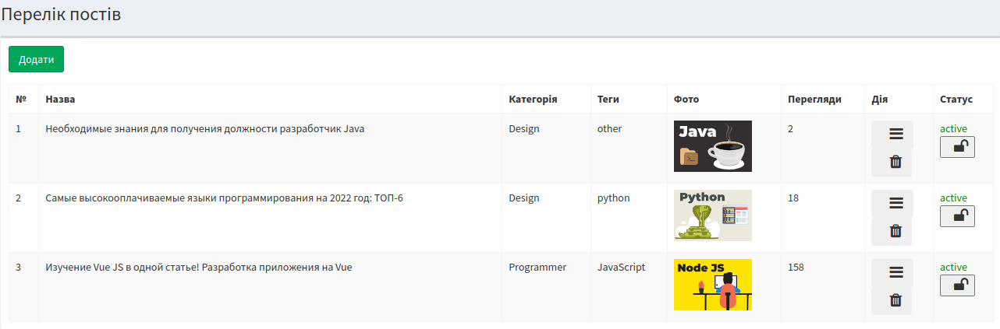

Пост изначально создается в статусе черновика, с возможность указать дату публикации поста.
После чего можно активировать(при подтверждении email) его или деактивировать.

    public function setDraft(): void
    {
        $this->status = 0;
        $this->save();
    }

    public function setPublic(): void
    {
        $this->status = 1;
        $this->save();
    }

    public function toggleStatus()
    {
        if ($this->status == 1) {
            return $this->setDraft();
        }

        return $this->setPublic();
    }

Администратор имеет полный список всех постов в блоге.
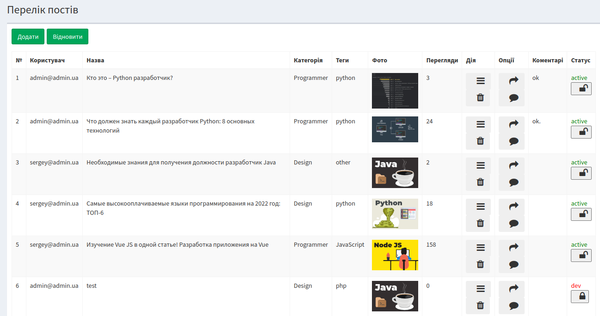

Может создать или восстановить пост, который был удален или удалить навсегда.

Может активировать или деактивировать пост. 

Написать комментарий к посту:

    public function addCommentPost(Request $request): RedirectResponse
    {
        $id = $request->get('id');
        $content = $request->get('content');
        $post = Post::all()->find($id);
        $post->comment = $content;
        $post->save();
        Log::info('Add comment: '.$post->title.' '.$post->comment.' --'.Auth::user()->name);
            return redirect()->route('posts.index');
        }

Отправить письмо автору поста:

    public function sendMailPost(Request $request): RedirectResponse
    {
        Mail::to($request->email)->cc(Auth::user()->email)->send(new SendMessageEmail($request->all()));
        Log::info('Send mail: '.$request->get('email').' '.$request->get('title').' --'.Auth::user()->name);
        return redirect()->route('posts.index');
        }

Имеется счетчик просмотров поста:

    $post->views += 1;

Изменть содержимое статьи может только автор:

    PostPolicy
    public function update(User $user, Post $post): bool
    {
    return $user->id === $post->user_id ? true : abort(403);
    }

    PostController
    public function update(PostRequest $request, int $id): RedirectResponse
    {
    $post = Post::all()->find($id);
    $this->authorize('update', $post);
    $post->edit($request->all());
    $post->uploadImage($request->file('image'));
    $post->setCategory($request->get('category_id'));
    $post->setTags($request->get('tags'));
    $post->toggleStatus($request->get('status'));
    $post->toggleFeatured($request->get('is_featured'));
    Log::info('Update post: '.$request->get('title').' --'.Auth::user()->name);
    return redirect()->route('posts.index');
        }
регистрация, поделится, с пом соц сетей, телескоп, просматривают
